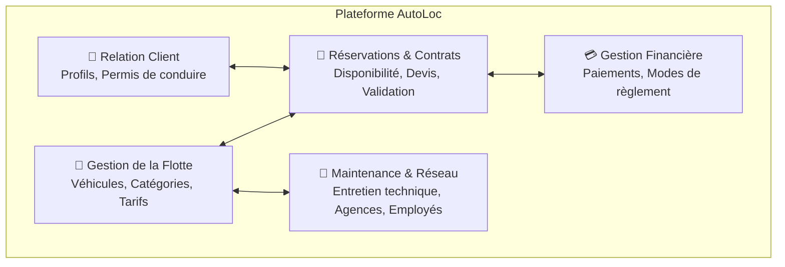

# 🚗 AutoLoc API — Plateforme de Gestion de Location de Véhicules

[](https://www.oracle.com/java/)
[](https://spring.io/projects/spring-boot)
[](https://spring.io/projects/spring-data-jpa)
[](https://hibernate.org/)
[](https://www.mysql.com/)
[](https://maven.apache.org/)

---

## 🎓 Cadre Académique

* **Établissement** : [ESPRIT](https://esprit.tn/) (École Supérieure Privée d'Ingénierie et de Technologies)
* **Unité Pédagogique** : **UP ASI** — Architecture des Systèmes d'Information
* **Niveau** : 4ᵉ Année Ingénieur Informatique (Année Universitaire 2026-2027)
* **Matière** : **Architecture des Systèmes d'Information (ASI)**
* **Étudiante** : **Molka Jebali**

### Objectifs de la Matière
Le module d'**Architecture des Systèmes d'Information** a pour but d'inculquer les principes fondamentaux de conception logicielle d'entreprise, en mettant l'accent sur :
* L'application des patrons d'architecture logicielle (*Layered Architecture*, séparation nette des responsabilités, Clean Code).
* L'ingénierie de la persistance relationnelle avec **JPA / Hibernate**.
* L'accès déclaratif aux données via **Spring Data**.
* La gestion transactionnelle et l'encapsulation de la logique métier dans la couche **Service**.
* L'exposition d'interfaces de programmation modernes via des **APIs RESTful** normalisées et découplées grâce aux **DTOs**.

---

## 📌 Présentation du Projet : AutoLoc

**AutoLoc** est une solution logicielle backend conçue pour numériser et optimiser l'ensemble des opérations d'une agence de location de véhicules. 

Le système centralise la gestion opérationnelle, commerciale, financière et organisationnelle à travers une architecture robuste et hautement évolutive.

### Modules Fonctionnels du Système



1. **Gestion de Flotte** : suivi en temps réel de l'état des véhicules (disponible, loué, en maintenance), classification par segment (citadine, berline, SUV, utilitaire) et politique tarifaire journalière.
2. **Gestion de la Clientèle** : fiches clients, vérification d'éligibilité et contrôle d'unicité des permis de conduire.
3. **Réservations & Contrats** : cycle de vie complet de la location (de la réservation en attente jusqu'à la signature du contrat et la clôture de la restitution).
4. **Gestion Financière** : enregistrement des transactions de paiement selon différents modes (carte, espèces, virement) et suivi des soldes contractuels.
5. **Opérations & Logistique** : planification des interventions d'entretien mécanique et structuration multi-agences avec gestion des employés (agents de comptoir et managers).

---

## 🏗️ Architecture Logicielle & Organisation

Le projet adopte une **architecture en couches d'entreprise** (*Layered Architecture*) visant à isoler les responsabilités et faciliter la maintenance :

```text
tn.esprit.autoloc
├── domain                     # Modèle de domaine : Entités JPA & Énumérations
│   ├── Agence.java            # Représentation physique des agences du réseau
│   ├── Client.java            # Fiche client avec contraintes d'unicité (email, permis)
│   ├── Contrat.java           # Formalisation contractuelle de la location
│   ├── Employe.java           # Collaborateurs et affectations
│   ├── Equipement.java        # Options additionnelles (GPS, siège bébé, etc.)
│   ├── Maintenance.java       # Interventions mécaniques et techniques
│   ├── Paiement.java          # Règlements financiers des locations
│   ├── Reservation.java       # Planification temporelle et statut de la réservation
│   ├── Vehicule.java          # Entité pivot du parc automobile
│   │
│   └── [Enums : CategorieVehicule, StatutVehicule, RoleEmploye, StatutReservation, ModePaiement]
│
├── repository                 # Couche d'accès aux données (Spring Data JPA)
│   └── Interfaces d'abstraction des requêtes et de la persistance en base
│
├── service                    # Couche Métier (Logique applicative & Transactions)
│   └── Règles de gestion d'entreprise, orchestration et validation métier
│
├── web.controller             # Couche d'exposition HTTP (APIs RESTful)
│   └── Contrôleurs REST, négociation de contenu et gestion des codes HTTP
│
├── web.dto                    # Couche de transfert (Data Transfer Objects)
│   └── Objets découplés pour sécuriser et optimiser les flux de données
│
└── DataInitializer.java       # Composant d'amorçage automatique des données de démo
```

---

## 📊 Modèle de Données Fondateur

Le modèle relationnel repose sur un ensemble d'entités structurées selon les principes du **Clean Code** et de la persistance JPA :

| Entité | Rôle Fonctionnel | Clé Primaire (`@Id`) | Attributs Principaux |
|--------|------------------|----------------------|-----------------------|
| **Vehicule** | Véhicules de la flotte | `idVehicule` | `immatriculation` (unique), `marque`, `modele`, `categorie`, `tarifJournalier`, `statut` |
| **Agence** | Agences physiques du réseau | `idAgence` | `nom`, `ville`, `adresse`, `telephone` |
| **Client** | Clients locataires | `idClient` | `nom`, `prenom`, `email` (unique), `telephone`, `numPermis` (unique), `dateInscription` |
| **Employe** | Personnel de l'entreprise | `idEmploye` | `nom`, `prenom`, `role` (`AGENT`, `MANAGER`) |
| **Equipement** | Équipements optionnels | `idEquipement` | `libelle` |
| **Reservation** | Demandes de location | `idReservation` | `dateDebut`, `dateFin`, `statut` (`EN_ATTENTE`, `CONFIRMEE`, etc.) |
| **Contrat** | Contrats signés | `idContrat` | `dateSignature`, `montantTotal`, `valide` |
| **Paiement** | Transactions financières | `idPaiement` | `montant`, `datePaiement`, `modePaiement` (`CARTE`, `ESPECES`, etc.) |
| **Maintenance** | Entretien et réparations | `idMaintenance` | `dateDebut`, `dateFin`, `description` |

### Bonnes Pratiques Appliquées
* **Lombok ciblé** : utilisation rigoureuse de `@Getter`, `@Setter`, `@NoArgsConstructor` et `@AllArgsConstructor`. L'annotation `@Data` est volontairement évitée pour prévenir les risques de récursivité infinie lors de la navigation dans les futures relations bidirectionnelles.
* **Stratégie d'identifiants** : génération déléguée native (`GenerationType.IDENTITY`).
* **Intégrité des données** : contraintes d'unicité et de non-nullabilité déclarées au niveau du schéma JPA.

---

## ⚙️ Configuration & Environnement

* **Base de données** : MySQL / MariaDB (`localhost:3306`).
* **Création automatique de la base** : `createDatabaseIfNotExist=true` pour un déploiement sans étape manuelle.
* **Port applicatif** : `8081` par défaut (`${PORT:8081}`) pour garantir l'absence de conflit réseau.
* **Génération automatique du schéma** : `spring.jpa.hibernate.ddl-auto=update`.
* **Traces SQL** : logs au niveau `DEBUG` pour auditer le SQL généré par Hibernate.
* **Profils Spring** :
  * `application.properties` : configuration standard de l'application.
  * `application-dev.properties` : profil de développement étendu.

---

## 🚀 Installation & Exécution Locale

### 1. Prérequis
* **Java Development Kit (JDK)** version 17 ou ultérieure.
* **SGBD MySQL / MariaDB** démarré sur le port 3306.

### 2. Démarrage de l'Application
```bash
# Cloner le dépôt
git clone https://github.com/MolkaJebali/AutoLoc.git
cd AutoLoc

# Démarrer le serveur de développement (Windows)
.\mvnw.cmd spring-boot:run

# Démarrer le serveur de développement (Linux / macOS)
./mvnw spring-boot:run
```

### 3. Compilation et Packaging du JAR Exécutable
```bash
.\mvnw.cmd clean package -DskipTests
java -jar target/autoloc-api-0.0.1-SNAPSHOT.jar
```

---

## 👩‍💻 Auteure

* **Molka Jebali** — Étudiante en 4ᵉ Année Ingénieur Informatique (UP ASI)
* **ESPRIT** — Année Universitaire 2026-2027
* **Dépôt GitHub** : [https://github.com/MolkaJebali/AutoLoc](https://github.com/MolkaJebali/AutoLoc)
