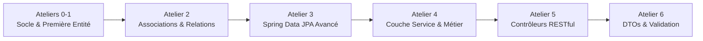

# 🚗 AutoLoc API — Plateforme de Gestion de Location de Véhicules

[](https://www.oracle.com/java/)
[](https://spring.io/projects/spring-boot)
[](https://spring.io/projects/spring-data-jpa)
[](https://hibernate.org/)
[](https://www.mysql.com/)
[](https://maven.apache.org/)

---

## 🎓 Cadre Académique & Contexte du Projet

* **Établissement** : [ESPRIT](https://esprit.tn/) (École Supérieure Privée d'Ingénierie et de Technologies)
* **Unité Pédagogique** : **UP ASI** — Architecture des Systèmes d'Information
* **Niveau** : 4ᵉ Année Ingénieur Informatique (Année 26-27)
* **Étudiante** : **Molka Jebali**
* **Matière** : **Architecture des Systèmes d'Information (ASI)**

### Présentation de la Matière
Le module d'**Architecture des Systèmes d'Information** a pour vocation de former les élèves-ingénieurs à la conception, l'urbanisation et l'implémentation de systèmes logiciels d'entreprise robustes, scalables et maintenables. 

À travers des travaux pratiques progressifs et un fil conducteur professionnalisant, ce cours approfondit :
* Les patrons d'architecture logicielle (*Layered Architecture*, séparation des responsabilités, Clean Code).
* L'ingénierie de la persistance relationnelle avec JPA / Hibernate.
* L'implémentation de couches d'accès aux données déclaratives (Spring Data).
* La gestion transactionnelle et l'encapsulation de la logique métier (Services).
* La conception d'interfaces de programmation modernes (API RESTful, DTOs, validations de flux).

---

## 📌 Vision Globale du Projet : AutoLoc

**AutoLoc** est le projet fil rouge développé tout au long des ateliers de la matière. Il s'agit d'une application backend d'entreprise complète dédiée à l'automatisation et à la gestion globale d'un réseau d'agences de location de véhicules.

### Périmètre Fonctionnel
* **Gestion du parc automobile** : cycle de vie des véhicules (statuts : disponible, loué, en maintenance), typologie (citadine, berline, SUV, utilitaire), caractéristiques techniques et tarification.
* **Gestion de la clientèle** : profil client, coordonnées, validation des permis de conduire et historique de fidélité.
* **Réservations & Contrats** : workflow de réservation (en attente, confirmée, annulée, terminée) et contractualisation avec calcul automatique des montants.
* **Gestion des paiements** : encaissement multi-modes (carte bancaire, espèces, virement) et traçabilité financière.
* **Suivi de maintenance** : planification des révisions, réparations et immobilisation temporaire des véhicules.
* **Organisation du réseau** : gestion multi-agences et affectation des employés (agents de comptoir, managers).

---

## 🏗️ Architecture Technique Globale

Le projet repose sur une architecture en couches étanches (*Multi-Tier / Layered Architecture*), garantissant une haute cohésion et un faible couplage :

```text
tn.esprit.autoloc
├── domain                     # Entités du modèle métier JPA & Énumérations
│   ├── Agence.java
│   ├── Client.java
│   ├── Contrat.java
│   ├── Employe.java
│   ├── Equipement.java
│   ├── Maintenance.java
│   ├── Paiement.java
│   ├── Reservation.java
│   ├── Vehicule.java
│   └── [Enums : CategorieVehicule, StatutVehicule, RoleEmploye, StatutReservation, ModePaiement]
│
├── repository                 # Couche d'accès aux données (Spring Data JPA)
│   └── Interfaces Repository (requêtes dérivées, JPQL, pagination)
│
├── service                    # Couche Métier (Règles applicatives & Transactions)
│   ├── Interfaces de service & Implémentations métier
│   └── Gestion des exceptions métier personnalisées
│
├── web.controller             # Couche d'exposition REST (Endpoints HTTP)
│   ├── Contrôleurs REST, routage et négociation de contenu
│   └── Gestionnaires d'erreurs globaux (@ControllerAdvice)
│
├── web.dto                    # Data Transfer Objects (DTO) & Mappers
│   └── Objets de transfert découplés pour l'API publique
│
└── config / util              # Configurations transverses (Sécurité, profils, CORS)
```

---

## 🗺️ Feuille de Route Évolutive des Ateliers (Roadmap)

Le développement d'AutoLoc se déploie de façon itérative tout au long des ateliers pratiques :



| Phase / Atelier | Thématique Principale | Objectifs & Livrables Clés |
|-----------------|------------------------|----------------------------|
| **Atelier 0 & 1** | **Fondations & Démarrage Spring Boot** | Initialisation de l'architecture Maven, configuration de la datasource MySQL, stratégie DDL Hibernate (`update`), première entité socle (`Vehicule`), mise en place des standards Clean Code et Lombok. |
| **Atelier 2** | **Modélisation Avancée des Associations** | Intégration des relations JPA (`@ManyToOne`, `@OneToMany`, `@ManyToMany`), gestion des clés étrangères, stratégies de cascade (`CascadeType`) et d'optimisation de chargement (`FetchType`). |
| **Atelier 3** | **Persistance Avancée & Repositories** | Implémentation des interfaces `JpaRepository`, requêtes dérivées par convention de nommage, requêtes JPQL / SQL natives via `@Query`, pagination et tri. |
| **Atelier 4** | **Logique Métier & Couche Service** | Encapsulation des règles métier au sein des services Spring (`@Service`), gestion transactionnelle déclarative (`@Transactional`), contrôle de cohérence et exceptions métier. |
| **Atelier 5** | **Exposition RESTful & Contrôleurs** | Construction des endpoints d'API REST (`@RestController`), manipulation des verbes HTTP (GET, POST, PUT, DELETE), codes statuts HTTP standards et gestion d'erreurs centralisée. |
| **Atelier 6** | **DTOs, Mapping & Sécurisation** | Découplage complet via DTOs (`Record` / classes DTO), bibliothèques de mapping automatique, validation fine des entrées utilisateur (`@Valid`, Bean Validation) et documentation d'API. |

---

## 📊 Modèle de Domaine Fondateur

Le cœur métier d'AutoLoc s'articule autour des entités pivots suivantes :

* **Vehicule** : identification (`immatriculation`), marque, modèle, catégorie, tarif journalier et statut.
* **Client** : identité complète, coordonnées de contact, numéro de permis de conduire unique et date d'inscription.
* **Contrat** : formalisation légale de la location, date d'accord, montant total et état de validation.
* **Reservation** : planification temporelle (date début, date fin) et statut d'avancement.
* **Agence** : point de service physique (nom, localisation, adresse et téléphone).
* **Employe** : collaborateur rattaché aux agences avec profil de droits (Agent, Manager).
* **Equipement** : options complémentaires associables aux véhicules (GPS, siège bébé, etc.).
* **Maintenance** : interventions de réparation et contrôles techniques périodiques.
* **Paiement** : règlement des locations avec montant, date et mode transactionnel.

---

## ⚙️ Environnement & Configuration Technique

* **Langage & Plateforme** : Java 17+ (LTS)
* **Framework principal** : Spring Boot
* **ORM & Persistance** : Spring Data JPA, Hibernate ORM
* **Base de données** : MySQL / MariaDB (Driver : `com.mysql:mysql-connector-j`)
* **Productivité & Clean Code** : Project Lombok (annotations ciblées `@Getter`, `@Setter`, etc.)
* **Outil de Build** : Maven avec son Wrapper (`mvnw`)
* **Gestion des Profils** :
  * `application.properties` : configuration globale et d'environnement par défaut.
  * `application-dev.properties` : profil de développement avec niveau de verbosité accru.

---

## 🚀 Guide de Démarrage Rapide

### 1. Prérequis
* JDK 17 ou supérieur installé (`java -version`).
* Serveur MySQL / MariaDB accessible sur `localhost:3306`.

### 2. Cloner et Lancer le Projet
```bash
# Cloner le dépôt
git clone https://github.com/MolkaJebali/AutoLoc.git
cd AutoLoc

# Démarrer avec le Maven Wrapper (Windows)
.\mvnw.cmd spring-boot:run

# Démarrer avec le Maven Wrapper (Linux / macOS)
./mvnw spring-boot:run
```

### 3. Compilation et Packaging
```bash
.\mvnw.cmd clean package -DskipTests
java -jar target/autoloc-api-0.0.1-SNAPSHOT.jar
```

---

## 👩‍💻 Auteure & Informations Académiques

* **Étudiante** : **Molka Jebali**
* **Classe** : 4ᵉ Année — UP ASI (Architecture des Systèmes d'Information)
* **Établissement** : ESPRIT — Année Universitaire 2026-2027
* **Dépôt Officiel** : [https://github.com/MolkaJebali/AutoLoc](https://github.com/MolkaJebali/AutoLoc)
